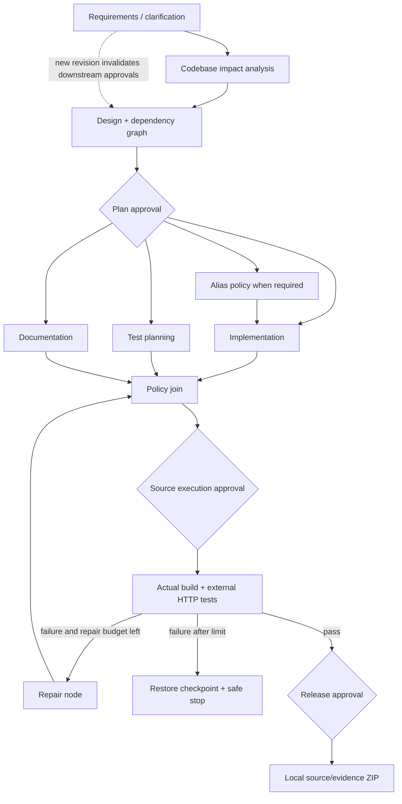

# Architecture and decisions

## Boundaries

The **control plane** is an ASP.NET Core application with EF Core/SQLite persistence. It owns the scheduler, policies, approvals, artifacts and validator. The **product** is a generated, separately runnable ASP.NET Core URL service. AI never decides whether its own output passed a gate.

The persisted graph within each revision is a DAG. A repair adds a new node and changes the policy join dependencies; the scheduler does not create an unbounded cycle. Revision history preserves the non-linear workflow across DAG versions.

## Explicit states and gates

- Run: `AwaitingClarification`, `Running`, `WaitingApproval`, `Paused`, `Completed`, `SafeStopped`.
- Stage: `Pending`, `Running`, `WaitingApproval`, `Completed`, `Failed`, `Superseded`, `Cancelled`.
- Entry: all declared dependencies must be `Completed`, the run/revision must be active, budgets must remain.
- Agent exit: contract-shaped response within size limits; implementation must satisfy the restricted rules grammar.
- Policy exit: exact source file allowlist; non-rules files must equal the trusted scaffold; no reparse points.
- Validation exit: child build exit code zero AND independent HTTP assertions all pass against the exact source fingerprint.
- Release exit: current validation, operator-approved current fingerprint and verified artifact hashes.

Approvals bind requirement revision, candidate bytes and artifact metadata. Actual artifact bytes are checked too. There is no generic "approve the next action" flag. A stale form submission returns 409. For runtime execution, the operator reviews the candidate rather than accepting an LLM's safety assessment.

## Stateful execution and lineage

SQLite stores one JSON run snapshot and separate append-only application event rows. Each transition writes its snapshot and event within one transaction. A process-level write semaphore serializes snapshot changes; a file lock forbids multiple service instances using the same data directory.

Events carry run ID, revision, stage ID, timestamp, sequence, previous hash and current hash. Agent-request events reference input artifact hashes and the carried-forward context hash. Artifacts retain producer, revision, file name and content hash.

Each agent receives accepted requirements, current rules and bounded completed-stage context. Repair additionally receives the actual failed validation report. Context is capped at 16,000 characters and model summaries at 20,000; artifacts preserve fuller evidence.

The hash chain detects accidental alteration through its verification function. It is **not WORM storage**: an administrator with the database can recompute it. External signing/anchoring would be needed for stronger audit guarantees.

## Requirement revisions

The ambiguous scenario first requires operator clarification. A later explicit revision:

1. Checks the expected revision and rejects stale callers.
2. Marks previous graph stages `Superseded`, preserving artifact and event history.
3. Increments the requirement revision and compiles a new graph.
4. Introduces an `AliasPolicy` task when aliases become required.
5. Cancels old in-flight work. Every completion also checks revision/status before it can affect persisted state.
6. Requires new approvals and validation; it does not carry old approval authority forward.

This MVP uses **conservative full descendant invalidation** rather than an optimized semantic dependency diff. That is deliberate: correctness over minimizing agent calls. A release already executing cannot be revised.

## Controlled autonomy and budgets

The global scheduler permits at most three active tasks and four unfinished runs. Per-run bounds: one provider retry, one code-repair attempt, 24 agent calls, five revisions, two hours elapsed. Each stage has a three-minute cancellation deadline; builds have a 120-second subprocess deadline. Human approval time counts toward run duration.

Only transient HTTP provider exceptions get the single bounded backoff/retry. Contract failures and unavailable authentication fail closed. Demo `provider-once` provides a reproducible retry demonstration without a live dependency.

Fault injection is only allowed with the **demo** provider. `expiration-once` deliberately generates a pure rule that ignores expiry; actual HTTP checks expose both the wrong status and click count. `expiration-always` keeps the fault during repair, forcing rollback/safe-stop.

## Workspace and rollback decision

**Deviation from the initial plan:** use versioned, isolated local directories instead of Git worktrees. This removes Git identity/branch assumptions and makes evaluation portable. Immutable source/artifact hashes provide checkpoint identity. These directories provide change isolation, **not a security sandbox**.

Brownfield reads a completed greenfield's source checkpoint. It changes `LinkRules.cs`; API/bootstrap/store files stay equal to trusted scaffolding. A rollback copies the exact approved baseline into `restored-checkpoint`. Failed candidates and evidence remain for inspection. No in-place destructive checkout or shared repository mutation occurs.

Rollback is scoped to **source**. There is no deployment, external write or production data migration to reverse. Do not describe this as universal distributed rollback.

## Security and compliance controls

- Loopback-only operator access, strict host checks, origin checks and a per-process mutation token.
- No CORS policy exposing the API to remote websites; no cloud uploads or publication endpoints.
- Generated code is restricted to pure rule identifiers/expressions; arbitrary project files, processes, network access and dependency additions are not accepted.
- Model sessions exclude all tools. Candidate source is reviewed before local execution.
- Child validator environment is reduced to required runtime/build variables; no Copilot/API token variables are forwarded.
- Fixed subprocess arguments (no shell interpolation), bounded output capture, explicit cancellation and owned process-tree cleanup.
- No destination URL fetches; URL scheme/user-info validation; primary-key uniqueness; atomic click increments.

These are prototype controls, not certification, malware analysis or a replacement for OS isolation. Extension of the code-generation surface would require a sandboxed worker and a stronger policy engine before autonomous execution.

## Reliability metrics

| Metric | Definition |
|---|---|
| Run success rate | Completed / terminal runs (`Completed` + `SafeStopped`) |
| Stage success rate | Stage-completion events / stage-start events, including failed attempts |
| Validation success rate | Successful validations / all completed validation attempts |
| Retry frequency | Runs with provider retry or repair / all runs |
| Rollback frequency | Runs with rollback / all runs |
| MTTR | Mean first-failed-validation to successful-revalidation duration among recovered runs |
| End-to-end latency | Run creation to completion/safe-stop, including operator waits |

Unrecovered failures have no recovery duration, not zero. Synthetic failures are included in demo statistics and labelled as such. These metrics are not production reliability claims.
